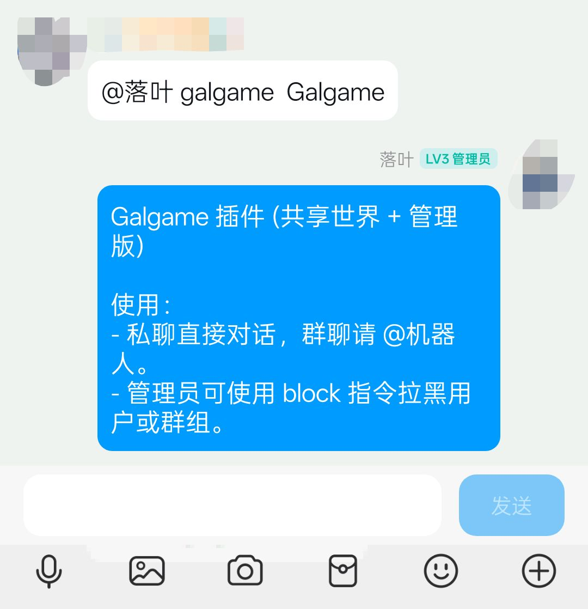

# **koishi-plugin-galgame**

**Galgame 风格的 AI 伴侣插件**。

将 DeepSeek AI 接入 Koishi，体验视觉小说般的对话体验。支持多用户共享记忆、独立好感度系统、自动扣图生成气泡、以及丰富的情绪立绘展示。

*(示例运行截图已包含在仓库的 `readmeimg` 文件夹中：下面为几张演示图，帮助展示插件在私聊/群聊中的显示效果。)*

示例截图：

## **✨ 特性 (Features)**

* **🎭 四大性格**：内置 奈奈(萝莉)、蕾娜(御姐)、小百合(少妇)、小薰(男娘) 四种预设人格。  
* **🌏 共享世界线**：所有人共享同一个 AI 的记忆，你的对话可能会被 AI 记住并告诉其他人！  
* **❤️ 独立好感度**：虽然记忆共享，但 AI 对每个人的好感度是独立的。支持动态好感度条显示。  
* **🖼️ 智能绘图**：  
  * 自动生成带情绪立绘的聊天气泡。  
  * **自动扣除白底**：只需准备白底立绘，插件会自动处理为透明背景。  
  * 双向进度条：直观展示“喜爱”与“厌恶”。  
* **🧠 深度沉浸**：支持 AI 心理活动展示 (\[心理: ...\])，让角色更鲜活。  
* **🛡️ 管理功能**：内置黑名单系统（用户/群组）与频率限制，防止滥用。

## **📦 安装 (Installation)**

在 Koishi 插件市场搜索 galgame 并安装。

或者使用 npm:

Bash

npm install koishi-plugin-galgame

## **📂 素材配置 (Resource Setup) \[重要\]**

本插件需要加载本地立绘图片。请在你的电脑或服务器上准备一个文件夹（例如 C:\\galgame-images），并按照以下结构存放图片。

**⚠️ 注意：文件夹名称必须严格一致！**

Plaintext

你的资源根目录/  
├── loli/            \<-- 对应人格：奈奈 (萝莉)  
│   ├── happy.png    (高兴)  
│   ├── sad.png      (悲伤)  
│   ├── angry.png    (生气)  
│   └── think.png    (思考/默认)  
├── gril/            \<-- 对应人格：蕾娜 (御姐)  
│   ├── happy.png  
│   ├── sad.png  
│   ├── angry.png  
│   └── think.png  
├── woman/           \<-- 对应人格：小百合 (少妇)  
│   ├── happy.png  
│   ├── ...  
└── mft/             \<-- 对应人格：小薰 (男娘)  
    ├── happy.png  
    ├── ...

* **图片格式**：推荐 .png 或 .jpg。  
* **背景**：可以是白底（插件会自动变透明）或透明底。

## **⚙️ 配置项 (Configuration)**

| 配置项 | 说明 | 默认值 |
| :---- | :---- | :---- |
| deepseekApiKey | **必填**，你的 DeepSeek API Key | \- |
| deepseekBaseUrl | DeepSeek API 地址 | https://api.deepseek.com |
| characterImageBasePath | **必填**，上面提到的素材根目录路径 | \- |
| admins | 管理员 QQ 号列表 (数组) | \[\] |
| maxRepliesPerMinute | 全局每分钟最大回复次数 (防刷屏) | 30 |
| enableFavorabilityDisplay | 默认是否显示好感度变化提示 | false |
| enableInnerThought | 默认是否显示 AI 心理活动 | false |
| minFavorabilityToRespond | 最低回复好感度 (低于此值不理人) | \-50 |

## **🎮 使用指令 (Usage)**

### **基础指令**

* **直接对话**：  
  * 私聊：直接发送消息。  
  * 群聊：@机器人 \+ 消息。  
* galgame：查看帮助信息。  
* galgame.switch \<角色名\>：切换你想互动的角色。  
  * 例如：galgame.switch 奈奈 或 galgame.switch 御姐。  
* galgame.fav \<开/关\>：开启或关闭好感度变化提示。  
* galgame.mind \<开/关\>：开启或关闭心理活动显示。

### **管理员指令**

* galgame.block.user \<用户ID\>：拉黑指定用户。  
* galgame.unblock.user \<用户ID\>：解禁指定用户。  
* galgame.block.group \<群号\>：拉黑指定群组。  
* galgame.unblock.group \<群号\>：解禁指定群组。  
* galgame.resetworld：**\[危险\]** 重置世界线（清空所有角色的全局记忆）。

## **💡 常见问题 (FAQ)**

Q: 为什么图片显示是方框？  
A: 请检查你的服务器/电脑是否安装了中文字体（如微软雅黑、黑体）。Linux 系统可能需要安装 fonts-noto-cjk 或将字体文件放入项目根目录。  
Q: 好感度条为什么是红色的？  
A: 当好感度为负数（讨厌）时，进度条会显示为红色并向左填充。  
Q: 如何获取 DeepSeek API Key？  
A: 请前往 DeepSeek 开放平台 申请。

## **📄 License**

MIT License

